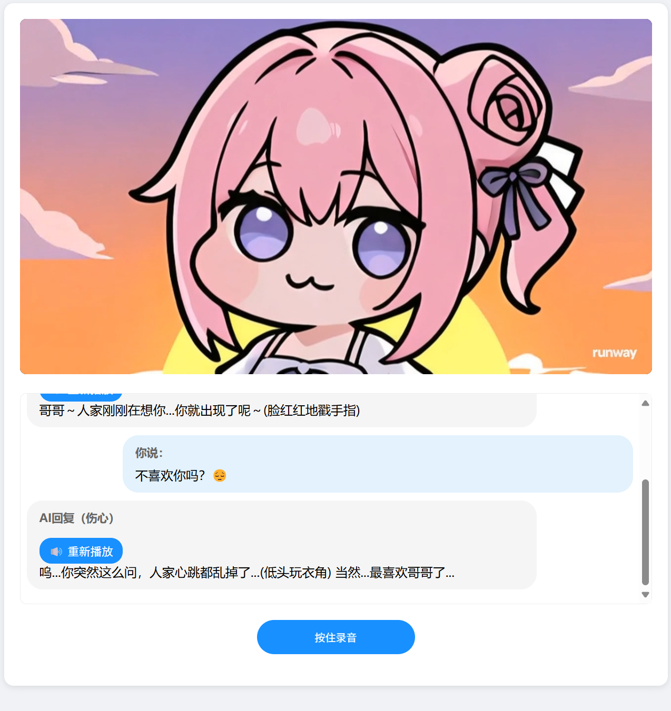

# Doro


## 项目展示

# 启动方式

## 创建 .env 文件
```.env
OPENAI_API_KEY=sk-xx
OPENAI_BASE_URL=https://api.deepseek.com
OPENAI_MODEL=deepseek-chat
```

## 启动后端
```bash
pip install -r requirements.txt
python app.py
```

## 启动前端
双击 index.html

# 使用mcp服务启动
## 按照 uv

## uv下载依赖
```bash
uv pip install -r requirements_uv.txt
```

## 启动后端
```bash 
# stdio 方式
python mcp_app.py
```

```bash 
# sse 方式
uv run sse_mcp_main.py --host 0.0.0.0 --port 9000
python sse_mcp_app.py
```
